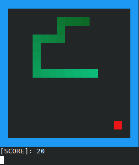

# Snake
My lightweight Snake implementation in C. It works in terminal and was tested on GNU/Linux only, with no plans to support running on Windows/OSX.
## Building
To build this program you need `clang` C compiler installed. To start run `./build run-release`. More info under `./build help`.
## Controls
<kbd>W</kbd>, <kbd>S</kbd>, <kbd>A</kbd>, <kbd>D</kbd>: up, down, left, right
<kbd>Q</kbd>: exit

